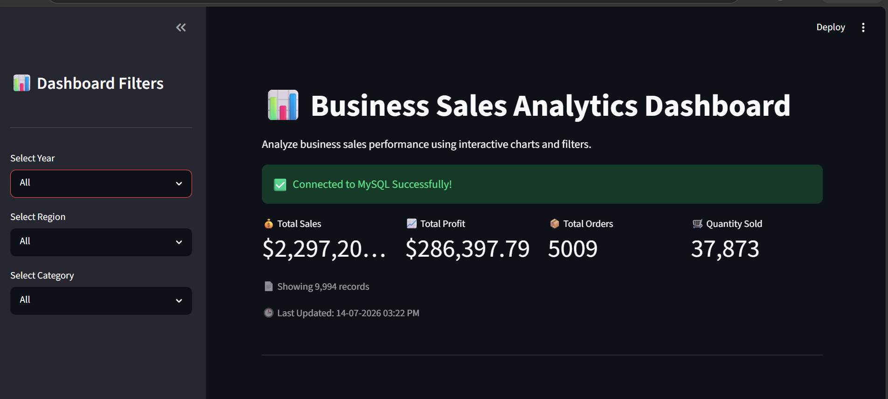
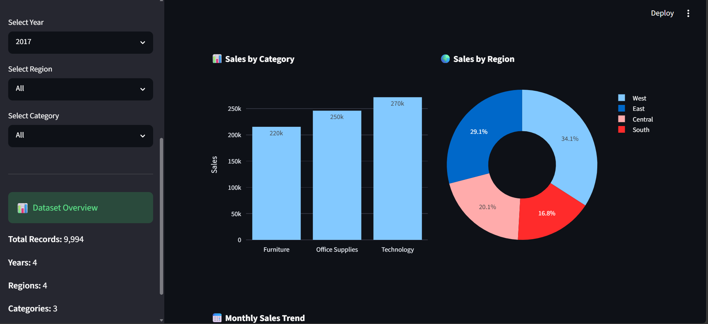
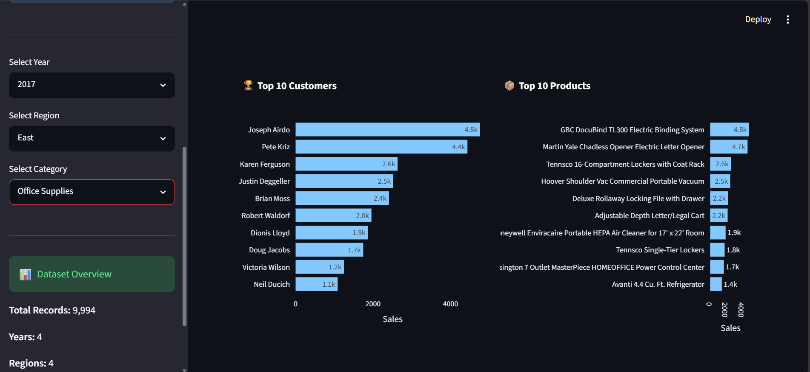
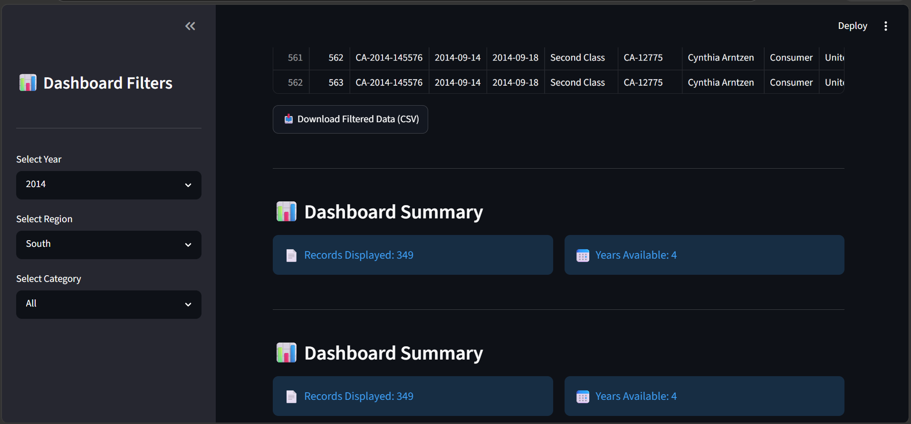

# 📊 Business Sales Analytics Dashboard

An interactive Business Sales Analytics Dashboard built using **Python**, **Streamlit**, **MySQL**, **Pandas**, and **Plotly**.

The dashboard helps analyze sales performance through interactive visualizations, KPI metrics, business insights, and downloadable reports. Users can filter data by year, region, and product category to explore sales trends and profitability.

---

## 🚀 Features

- 📈 Interactive KPI Cards
- 📊 Sales by Category Chart
- 🌍 Sales by Region Pie Chart
- 📅 Monthly Sales Trend
- 🏆 Top 10 Customers
- 📦 Top 10 Products
- 💰 Profit by Category
- 🔍 Sidebar Filters
- 📥 Download Filtered Data (CSV)
- 🔒 Secure Database Credentials using `.env`

---

## 🛠️ Technology Stack

| Category | Technologies |
|----------|--------------|
| Programming Language | Python |
| Dashboard Framework | Streamlit |
| Database | MySQL |
| Data Analysis | Pandas |
| Data Visualization | Plotly |
| Database Connector | PyMySQL |
| Environment Variables | python-dotenv |
| Version Control | Git & GitHub |

---

## 📁 Project Structure

```text
business-sales-analytics-dashboard/
│
├── dashboard/
│   └── app.py
│
├── data/
│
├── database/
│
├── screenshots/
│
├── sql/
│
├── src/
│
├── .gitignore
├── README.md
├── requirements.txt
├── LICENSE
└── .env (not uploaded to GitHub)
```

---

## ⚙️ Installation & Setup

### 1️⃣ Clone the Repository

```bash
git clone https://github.com/Devayani-Munasa/business-sales-analytics-dashboard.git
```

### 2️⃣ Navigate to the Project Folder

```bash
cd business-sales-analytics-dashboard
```

### 3️⃣ Create a Virtual Environment

```bash
python -m venv venv
```

### 4️⃣ Activate the Virtual Environment

**Windows**

```bash
venv\Scripts\activate
```

**Linux / macOS**

```bash
source venv/bin/activate
```

### 5️⃣ Install Dependencies

```bash
pip install -r requirements.txt
```

### 6️⃣ Create a `.env` File

Create a file named `.env` in the project root and add:

```env
DB_HOST=127.0.0.1
DB_USER=your_mysql_username
DB_PASSWORD=your_mysql_password
DB_NAME=sales_dashboard
```

### 7️⃣ Run the Dashboard

```bash
streamlit run dashboard/app.py
```

The application will open in your browser at:

```
http://localhost:8501
```
---

# 📸 Dashboard Preview

### 🏠 Dashboard Overview



---

### 📊 Interactive Charts



---

### 🔍 Sidebar Filters



---

### 💡 Business Insights


---

### 📋 Sales Data Table



---

# 🎯 Skills Demonstrated

This project demonstrates practical experience in:

- Python Programming
- SQL & MySQL Database Management
- Data Cleaning and Analysis using Pandas
- Interactive Dashboard Development with Streamlit
- Data Visualization using Plotly
- Git & GitHub Version Control
- Environment Variable Management (`.env`)
- Writing SQL Queries for Business Analysis
- Building Interactive Business Dashboards
- Project Documentation using Markdown

---

# 🚀 Future Improvements

Some enhancements planned for future versions include:

- User authentication and role-based access
- Advanced dashboard filters
- Interactive date range selection
- Export reports in PDF format
- Email report generation
- Predictive sales forecasting using Machine Learning
- Cloud database integration
- Dashboard deployment with a live demo link

---

## 👩‍💻 Author

**Devayani Munasa**

- GitHub: https://github.com/Devayani-Munasa
- LinkedIn: https://www.linkedin.com/in/devayani-munasa/

If you found this project useful, feel free to ⭐ the repository.